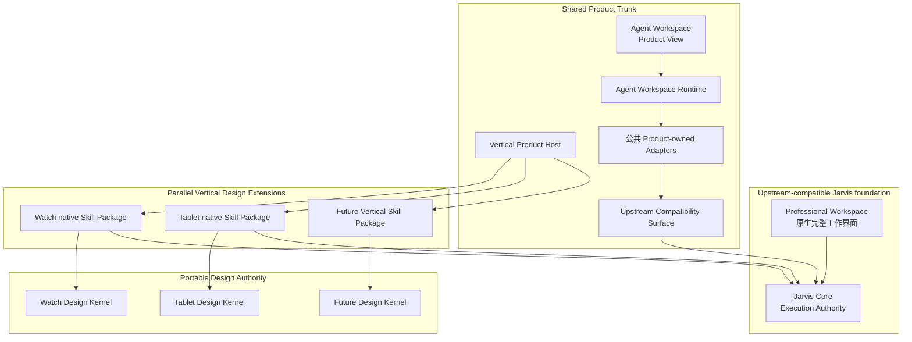
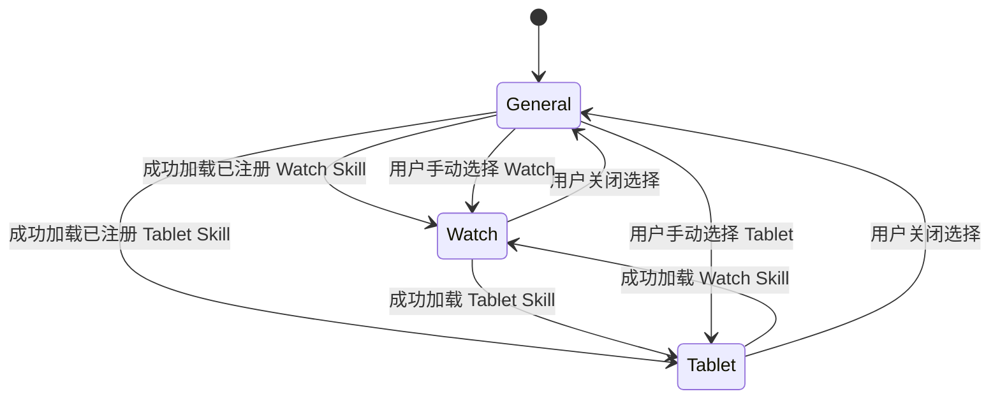
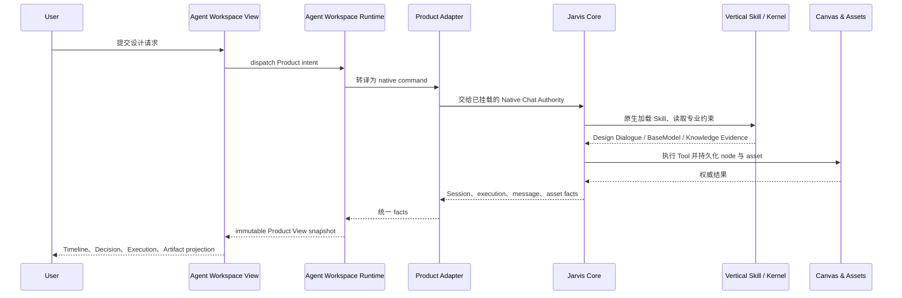

# Shared Product Trunk 架构指南

本文是 Enterprise Vertical Design Product 的主要架构入口。它服务两个目的：帮助人和 Agent 建立正确的系统心智模型，以及在开发时校准已经确定的架构决策。

本文讲“系统为什么这样分、改动应该放在哪里”。精确定义以 [`CONTEXT.md`](../CONTEXT.md) 为准；关键决策及其理由以 [`docs/adr/`](adr/) 为准；具体垂类接入和上游维护分别见 [`vertical-development.md`](vertical-development.md) 与 [`upstream-maintenance.md`](upstream-maintenance.md)。

## 1. 先建立一组通用心智模型

这些词不是 JarvisHub 专有名词，而是理解大型软件系统的一组通用工具。

### Authority：谁拥有最终裁决权

Authority 不是“谁参与了处理”，而是当两个地方说法冲突时，**谁的结果算数**。

数据库可以是订单状态的 Authority；编译器可以是类型是否合法的 Authority；支付平台可以是交易是否完成的 Authority。一个系统可以有多种 Authority，但同一种事实不应同时有两个互不协调的 Authority。

本系统刻意分开两种权威：

- **Execution Authority** 决定工作怎样执行、委派、重试、持久化和追踪，属于 Jarvis Core。
- **Design Authority** 决定某个专业垂类中什么是有效设计、需要哪些证据、应满足什么质量标准，属于该垂类的 Portable Design Kernel。

“专业标准属于 Kernel”不意味着 Kernel 可以启动第二套 Agent 循环；“执行属于 Jarvis”也不意味着 Jarvis 可以随意改写垂类专业标准。

### Runtime：让能力真正持续运行的机制

Runtime 是把状态、事件、生命周期和命令连接起来的运行机制。它不是一组说明文档，也不是一个页面。

Agent Workspace Runtime 持续读取 Jarvis 的权威事实，把它们投影成 Product View snapshot，订阅变化，并把 Product intent 转成原生命令。Vertical Skill 只是被 Jarvis 加载的专业能力包，不是另一个 Runtime。

一个常见错误是：为了给某个垂类增加几个步骤，顺手建立垂类自己的状态机、任务循环和持久化。这样表面上是“插件”，实际上已经复制了 Runtime 和 Authority。

### View 与 Projection：同一事实的不同呈现

View 是对权威事实的可交互呈现；Projection 是把权威模型转换成特定 View 所需形状的过程。

同一个 Jarvis Project、Session、Artifact 或执行状态，可以在 Professional Workspace 中完整呈现，也可以在 Agent Workspace 中以更紧凑的 Product Timeline 呈现。后者不因此拥有一份新的 Project、Artifact 或执行状态。

判断一个 View 是否越权的简单方法是：关闭这个 View 后，专业事实和工作进度是否仍完整存在？如果答案是否定的，View 很可能已经偷偷变成了第二个后台。

### Shell：组织产品体验的外壳

Shell 负责导航、布局、品牌和主要入口。它可以组织多个 View，但不应因此拥有这些 View 所呈现的业务事实。

Product Chat Shell 是 Agent Workspace 的产品外壳；Professional Workspace 保留 Jarvis 原生的完整工作界面。两者共享同一 Current Project Context，而不是共享一套前端 DOM 或复制一套状态。

### Adapter：翻译，而不是接管

Adapter 连接两个已经存在、语言不同的模型。例如，把 Product intent 翻译成 Native Chat command，或把 Jarvis Flow 中的节点和资产翻译成 Product Timeline 中的 Artifact Card。

一个健康的 Adapter：

- 隐藏两侧表示差异；
- 保留原有 Authority；
- 不创建影子账本；
- 可以被替换或删除，而不会破坏被适配系统的原生行为。

如果 Adapter 开始决定专业语义、管理长期生命周期或保存一份“同步状态”，它就不再只是 Adapter。

### Seam：有意留下的窄连接点

Seam 是可以低成本插入、替换或移除行为的位置。它的价值不在于多，而在于让变化集中。

在本项目中，Product-owned Adapter 可以很深，但它与上游派生文件之间的 Seam 必须很窄。上游文件只负责调用或注册，不承载 Product 行为。这样升级上游时，我们只需重新核对少数显式触点。

一个 Adapter 可能只是对未来变化的假设；当两个真实垂类都通过同一个接口工作时，这个 Seam 才得到更强的架构证据。Watch 与 Tablet 的并行运行正用于检验哪些能力真正属于 Shared Product Trunk。

### Kernel、Package、Host 与 Trunk

- **Kernel** 保存一个专业领域中耐久、可移植的知识、规则和质量判断。
- **Package** 把 Kernel 内容封装成某个宿主可发现和加载的形式。本项目使用原生 Skill Package。
- **Host** 发现和接入 Package，但不吸收它的专业 Authority。
- **Trunk** 是所有垂类共同依赖和共同维护的主线。

它们的关系不是“平台核心加载一堆回调插件”，而是“一个稳定宿主加载若干自包含的专业能力包”。

## 2. 系统地图：共同枝干与平行垂类

可以把系统理解为一棵树：Jarvis Core 是稳定根系，Agent Workspace 和 Product Host 是共享枝干，Watch、Tablet 等 Vertical Design Extensions 是平行分支。分支携带不同专业知识，但不各自复制根系和枝干。

图中是责任关系，不是部署拓扑。当前 Demo 可以在同一服务和同一界面中装载多个 Vertical Package；未来客户权限、租户和部署隔离尚未决定。

### 三层责任

从开发角度，可以把上图收敛为三层：

1. **Jarvis foundation**：Jarvis Core 与 Professional Workspace。它拥有执行和持久化，Product 不复制它。
2. **Shared Product infrastructure**：Agent Workspace Runtime、Product View、公共 Adapter、Vertical Product Host 和 Upstream Compatibility Surface。它必须与品类无关。
3. **Vertical professional branch**：Watch、Tablet 及未来垂类各自的 Skill Package 和 Portable Design Kernel。它只提供专业内容和约束。

判断一项新能力放在哪里，先问：

- 没有 Watch 或 Tablet，这项能力是否仍成立？成立则更可能属于 Shared Product Trunk。
- 它定义的是专业设计真理，还是怎样执行工作？前者属于 Kernel，后者应复用 Jarvis。
- 第二个垂类需要复制代码才能使用吗？如果需要，可能漏掉了共享基础设施 Seam。
- 删除某个 Vertical Package 后，Jarvis 和 Agent Workspace 是否仍能通用运行？必须能。

## 3. Authority 与状态归属

| 事实或行为 | Authority / 所有者 | 其他层可以做什么 | 不允许做什么 |
| --- | --- | --- | --- |
| Agent、Sub-agent、Tool、重试、恢复、Trace | Jarvis Core | Adapter 转译命令和结果 | Vertical 建立第二套执行循环 |
| Project、Flow、Session、Canvas node、asset、Artifact 持久化 | Jarvis | View 投影、导航和发出原生命令 | Product View 建影子记录或同步账本 |
| 专业知识、BaseModel、Design Dialogue、质量规则 | Portable Design Kernel | Jarvis 加载并执行，View 呈现结果 | Host 或 Runtime 重写专业含义 |
| Agent Workspace snapshot 和 intent dispatch | Agent Workspace Runtime | Adapter 读取 Jarvis facts、执行 native commands | Runtime 拥有耐久专业事实 |
| 布局、面板、焦点、滚动等临时呈现状态 | 对应 View | 本地管理 | 把它误当作项目或执行状态持久化 |
| 当前 Vertical 选择 | 原生 Chat Session / Composer Skill 状态 | Product Host 识别已完成的原生 Skill load | Project 绑定、前端关键词分类、另建激活数据库 |
| 客户可见垂类、权限、租户、部署隔离 | 当前未决定 | Demo 中并存多个垂类 | 把 Demo 隐藏逻辑声称为安全边界 |

核心原则是：**投影可以不同，事实只能有一个权威来源。**

## 4. 三个关键运行流程

### 4.1 Vertical 识别与激活

用户不需要先进入一个品类启动器。Jarvis 保留通用能力，并在理解任务后通过原生 `Skill` Tool 加载相应 Skill。

只有同时满足以下条件，自动识别才成立：

1. 发生真实的原生 `Skill` Tool load；
2. load 已完成且成功；
3. Skill key 位于 compile-time Vertical Skill Registry；
4. 前端能从原生 Skill discovery 找到该 Skill。

选择保存在已有 Chat Session 的 Composer Skill scope。普通 Skill 不参与 Vertical 互斥；加载新的已注册 Vertical 会替换旧 Vertical。关闭后 Jarvis 回到不受垂类窄化的通用状态。清晰的新意图可以切换垂类，含糊的后续则保持当前垂类惯性或请求一次澄清。

### 4.2 从 Agent Workspace 到 Artifact

Runtime 不执行 Agent；View 不生成 Artifact；Kernel 不写第二个数据库。每层只做自己的工作，因此用户可以在 Agent Workspace 和 Professional Workspace 之间切换并看到同一事实。

### 4.3 Public Chat 的交付真相

Media Agent 或 Tool 报告成功，不等于用户已经得到可用资产。交付必须把本轮成功声明与 Jarvis Flow/Canvas 的实际持久化结果协调起来。

Public Chat Delivery Adapter：

1. 收集同一 turn 中 Media 的终态成功 node ID；
2. 读取权威 Flow graph；
3. 只核对这些明确声明的 node，不猜测“最新 Canvas node”；
4. 从成功持久化的 node 恢复稳定 asset identity 和 URL；
5. 去重并放入响应；
6. 根据是否存在可用 Artifact 校准最终 verdict。

结果语义为：

- **satisfied**：要求满足，响应包含可用的权威资产；
- **partial**：可用 Artifact 已持久化，但之后的非关键 runtime completion 失败；
- **failed**：没有可用的权威 Artifact，或仍有不能被交付事实满足的失败原因。

未能在权威 Flow 中确认的成功声明会记录为 unresolved，而不会通过扫描最新节点来“补成功”。已经持久化的可用 Artifact 也不会因为后续步骤失败而被丢弃或误报为完全失败。

## 5. 开发时怎样做架构判断

### 先确定 Authority，再决定 Module

不要从“我想把代码放在哪个目录”开始。先判断这项变化属于哪种事实：

- 专业设计标准变化：修改对应 Portable Design Kernel / Skill Package。
- 通用 Product 交互变化：修改 Shared Product Trunk。
- 原生执行行为变化：优先使用或修复 Jarvis Core，不在 Product 层模拟。
- 两侧模型差异：在 Product-owned Adapter 中翻译，并尽量复用已有 Seam。

### Adapter 应该深，接触面应该窄

复杂翻译可以集中在 Product-owned Adapter 内。不要为了“薄 Adapter”把转换逻辑散回 Native Chat、Canvas 或 API bridge。相反，上游派生文件中的连接代码必须薄：最好只是一次调用、注册或数据传递。

删除 Product-owned Adapter 及其注册 Seam 后，原生 Jarvis 应继续运行。这是判断 Authority 是否泄漏的 deletion test。

### 共享基础设施必须由真实复用证明

不要先设计一个万能 Vertical plugin SDK。先让 Watch 和 Tablet 以平行 Package 工作；只有两者确实重复、且重复内容与专业领域无关时，才把它提升到 Shared Product Trunk。

应提升的例子：Skill discovery、互斥选择、通用 Artifact projection。

不应提升的例子：Watch 佩戴性规则、Tablet Form System、某个垂类专属的 Artifact BaseModel。

### 测试最高稳定 Seam

测试外部行为，而不是文件布局：

- Agent Workspace Runtime 测试 snapshot、subscription 与 intent dispatch；
- Vertical activation 测试真实完成的 Skill load 如何改变 Session-visible selection；
- Delivery Adapter 测试声明、持久化、资产和 verdict 的协调；
- Professional Workspace 用 native build 和兼容合同保护；
- Vertical Package 用 validator 和真实 Artifact 验收保护专业交付。

## 6. 不可自行推翻的既定决策

以下是当前架构基线。修改它们需要明确的新决策，而不是在一次功能开发中顺手绕过。

1. **Jarvis Core 是唯一 Execution Authority。** Vertical 不拥有 Agent loop、Tool lifecycle、retry、persistence 或 Trace。见 [ADR-0003](adr/0003-separate-execution-authority-from-design-authority.md)。
2. **Portable Design Kernel 是对应垂类的 Design Authority。** 专业知识和质量标准不由 Product Host 或 Jarvis prompt convenience 重新定义。见 [ADR-0010](adr/0010-separate-portable-design-authority-from-harness-execution.md)。
3. **耐久产品事实保留在 Jarvis。** Agent Workspace 只投影和发命令，不创建 Project、Session、Artifact 或资产影子系统。见 [ADR-0008](adr/0008-keep-durable-product-state-authoritative-in-jarvis.md) 与 [ADR-0013](adr/0013-own-agent-workspace-behind-one-runtime.md)。
4. **Professional Workspace 保持上游原生。** Product 只通过最小 Workspace Integration Seam 增加往返入口，不重做 Canvas、Chat、布局和主题。见 [ADR-0009](adr/0009-use-the-complete-native-canvas-as-the-professional-workspace.md)。
5. **维护一个 Shared Vertical Product Mainline。** Watch、Tablet 和未来垂类是共享主线上的平行 Package，不建立长期产品 fork。见 [ADR-0014](adr/0014-maintain-one-mainline-with-packaged-design-verticals.md)。
6. **Vertical 是自包含的原生 Skill Package。** Registry 只保存 Skill key，不发展 callback-heavy plugin framework。见 [ADR-0014](adr/0014-maintain-one-mainline-with-packaged-design-verticals.md)。
7. **已注册 Vertical 相互排斥，但不窄化 Jarvis 通用能力。** 自动识别以成功的原生 Skill load 为准，不使用前端关键词分类器。见 [ADR-0015](adr/0015-activate-recognized-vertical-skills-without-narrowing-jarvis.md)。
8. **对上游派生文件的接触必须显式注册。** Product 行为进入 Product-owned Adapter；一般 Jarvis 修复作为临时 Upstream Patch 管理。见 [ADR-0016](adr/0016-maintain-upstream-compatibility-through-registered-seams.md)。
9. **交付必须尊重权威持久化事实。** 同 turn 的可用 Artifact 应进入响应；后续非关键失败不得抹除成功结果。见 [ADR-0016](adr/0016-maintain-upstream-compatibility-through-registered-seams.md)。
10. **当前 Demo 不预先决定客户交付架构。** 权限、租户、每客户可见 Vertical 和部署隔离在真实合同需求出现前保持 deferred。见 [ADR-0014](adr/0014-maintain-one-mainline-with-packaged-design-verticals.md)。

ADR-0002 的“每个产品 fork 一个垂类”已经被 ADR-0014 取代。历史 ADR 保留用于解释决策演进，不能作为当前实现依据。

## 7. 当前边界

### 已实现并受测试保护

- Watch 与 Tablet 作为两个原生 Vertical Skill Package 安装；
- compile-time registry 与启动 discovery 校验；
- 成功原生 Skill load 驱动互斥选择；
- Agent Workspace 通过一个深 Runtime 投影 Jarvis facts 并 dispatch intents；
- Native Chat Authority 保持挂载，通过 Product-owned Adapter 接收命令；
- Public Chat Delivery Adapter 协调 Media completion 与 Canvas persistence；
- Upstream Compatibility Surface、检查器和临时 worktree replay。

### 已决定、仍可继续收敛

- 减少 Native Chat 中遗留的宽 diff；
- 将一般性 Jarvis 修复提交上游，并在上游吸收后删除本地 Patch；
- 只有当第二个真实垂类证明复用价值时，继续深化 Shared Product Trunk。

### 明确推迟

- 客户权限、身份授权和租户模型；
- 每个部署激活一个 Vertical 的正式策略；
- 客户之间的数据和部署隔离；
- cross-device Vertical preference；
- runtime plugin marketplace；
- 通用化所有专业领域的 super-schema。

“推迟”不是“永远不做”，也不是允许当前 Demo 冒充安全实现。它表示这些问题必须由未来真实交付约束重新开启。

## 8. 开始开发前的最短校准

面对一项改动，只需先回答五个问题：

1. 这项事实或行为的 Authority 是谁？
2. 它是品类无关的共享能力，还是垂类专业判断？
3. 能否通过现有 Runtime Interface 和 Adapter 完成？
4. 是否触碰上游派生文件；若触碰，是否是已注册的窄 Seam 或独立 Upstream Patch？
5. 删除 Product 或该 Vertical 后，原生 Jarvis 和其他垂类是否仍然成立？

如果这五个问题没有清楚答案，先不要增加新的 Runtime、状态表、callback 或 fork。

## 继续阅读

- 精确术语：[`CONTEXT.md`](../CONTEXT.md)
- 新增或修改垂类：[`vertical-development.md`](vertical-development.md)
- 上游升级：[`upstream-maintenance.md`](upstream-maintenance.md)
- Product View：[`agent-workspace-product-view.md`](agent-workspace-product-view.md)
- Interaction Continuity：[`agent-workspace-interaction-continuity-spec.md`](agent-workspace-interaction-continuity-spec.md)
- 当前 Vertical 验收：[`vertical-product-mvp-acceptance.md`](vertical-product-mvp-acceptance.md)
